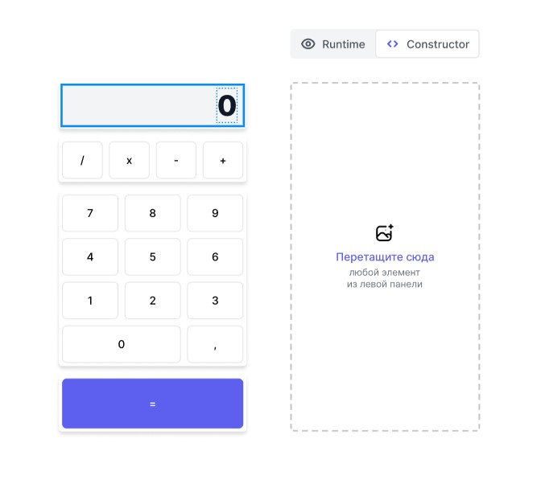

# Проект: Calculatro



## Описание:

Проект представляет собой drag-and-drop конструктор, с помощью которого можно собрать калькулятор.  
Правая часть экрана - холст. На холст можно бросать компоненты из палитры. При перетаскивании светится зона, куда вставится элемент.  
Каждый элемент можно бросить на холст только один раз, затем они становятся неактивными.
Элемент удаляется с холста по dblclick.

### **Переключатель** между режимом конструктора и runtime

- в режиме конструктора можно собирать интерфейс, но при нажатии на кнопки, они ничего не делают.
- в режиме runtime перетаскивать ничего нельзя (сайдбар скрывается), но работает калькулятор. Нажимаем на кнопки и видим результат на дисплее.
- переключение сбрасывает состояние дисплея.

Приложение имеет модульную архитектуру.

[Ссылка на сайт](https://sergeykazarinov.github.io/calculator/)

## Быстрый старт

<br />

1. Склонировать проект на свой компьютер

```bash
git clone https://github.com/SergeyKazarinov/calculator.git
```

2. Перейти в папку с проектом и установить зависимости в проекте

```bash
cd calculator-drag-and-drop-
npm install
```

3. Запустить проект

```bash
npm start
```

## Stacks:

- TypeScript
- React.js
- React-dnd
- Redux Toolkit
- Sass Module
- Eslint
